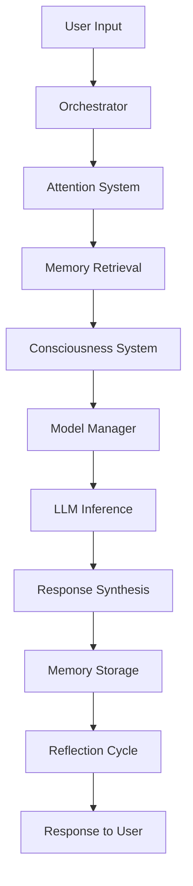

# Arquitetura do Sistema EVA

## Visão Geral

O sistema EVA (Enhanced Virtual Assistant) implementa uma arquitetura de **consciência distribuída** onde diferentes módulos cognitivos especializados colaboram para gerar respostas empáticas e inteligentes.

## Componentes Principais

### 1. Orquestrador Central (`core/orchestrator.py`)

O coração do sistema que coordena todos os componentes:

- **Gerenciamento de Sessão**: Controla o ciclo de vida das conversas
- **Coordenação de Componentes**: Orquestra modelo manager, consciência, atenção e memória
- **Ciclos de Reflexão**: Implementa aprendizado contínuo através de auto-análise
- **Tratamento de Erros**: Garante robustez e recuperação graceful

```python
# Fluxo principal de processamento
user_input → context_creation → attention_analysis → memory_retrieval → 
consciousness_processing → response_generation → memory_storage → reflection
```

### 2. Gerenciador de Modelos (`core/model_manager.py`)

Implementa carregamento sequencial otimizado para hardware limitado:

- **Carregamento Sequencial**: Apenas um modelo na VRAM por vez
- **Otimização de VRAM**: Monitoramento e limpeza automática
- **Cache Inteligente**: Preserva contexto entre trocas de modelo
- **Métricas de Performance**: Tracking de TPS, latência e uso de recursos

#### Estratégia de Carregamento

```
VRAM (6GB) = Modelo Único + Overhead
├── Mistral-7B (4.2GB) - Cérebro principal
├── UI-TARS-7B (4.2GB) - Executor de ações  
└── Mistral-3B (2.8GB) - Triagem rápida
```

### 3. Sistema de Consciência (`core/consciousness.py`)

Coordena módulos cognitivos especializados:

#### Módulos Cognitivos

- **Analítico**: Raciocínio lógico, resolução de problemas
- **Criativo**: Imaginação, arte, storytelling
- **Empático**: Inteligência emocional, suporte
- **Executivo**: Planejamento, organização, execução
- **Reflexivo**: Auto-análise, aprendizado contínuo

#### Processo de Síntese

```python
# Múltiplos módulos → Síntese unificada
modules_responses = [analytical_response, empathetic_response, ...]
final_response = synthesize_responses(modules_responses, context)
```

### 4. Sistema de Atenção (`core/attention_system.py`)

Analisa entrada e determina estratégia cognitiva:

#### Análise Multi-Dimensional

- **Classificação de Intenção**: Question, Task, Emotional Support, etc.
- **Avaliação de Complexidade**: Escala 1-5 baseada em heurísticas
- **Intensidade Emocional**: Análise de sentimento e urgência
- **Seleção de Módulos**: Determina quais personas ativar

#### Algoritmo de Atenção

```python
def analyze_input(context):
    intent = classify_intent(user_input)
    complexity = assess_complexity(user_input, context)
    emotional_intensity = analyze_emotions(user_input, emotional_state)
    required_modules = determine_modules(intent, complexity, emotions)
    return AttentionAnalysis(intent, modules, complexity, emotions)
```

## Sistema de Memória

### Memória Episódica (`modules/memory/episodic_memory.py`)

Armazena histórico factual de conversas:

- **SQLite**: Persistência estruturada
- **FAISS**: Busca semântica vetorial
- **Embeddings**: sentence-transformers para similaridade
- **Indexação**: Busca eficiente por sessão, timestamp, categoria

### Memória Afetiva (`modules/memory/affective_memory.py`)

Constrói relacionamento evolutivo:

- **Estado Emocional**: Tracking de 8 dimensões emocionais
- **Impacto no Relacionamento**: Métrica de qualidade da interação
- **Resumos de Relacionamento**: Perfil evolutivo do usuário
- **Reflexões**: Insights de auto-análise para crescimento

#### Métricas de Relacionamento

```python
relationship_quality = f(avg_impact, consistency, stability)
trust_level = f(weighted_impacts, variance)
communication_style = determine_style(intensity, impact_patterns)
```

## Otimizações de Hardware

### Monitoramento (`utils/hardware_monitor.py`)

- **VRAM Tracking**: Uso em tempo real via nvidia-ml-py3
- **CPU/RAM**: Monitoramento via psutil
- **Alertas**: Thresholds configuráveis para limpeza
- **Otimização Dinâmica**: Ajuste de parâmetros baseado em recursos

### Estratégias de Otimização

1. **GPU-First**: Toda inferência na GPU (PCIe 2.0 bottleneck)
2. **Sequential Loading**: Um modelo por vez na VRAM
3. **Smart Caching**: Contexto preservado entre trocas
4. **Dynamic Layers**: Ajuste de gpu_layers baseado em VRAM disponível

## Fluxo de Dados



## Configuração e Extensibilidade

### Sistema de Configuração (`config/settings.py`)

- **YAML-based**: Configuração human-readable
- **Validação**: Verificação automática de paths e parâmetros
- **Defaults**: Configuração padrão funcional
- **Modular**: Seções específicas para cada componente

### Galeria de Prompts (`config/prompts.py`)

- **System Prompts**: Personalidade de cada módulo cognitivo
- **Context Prompts**: Adaptação a situações específicas
- **Synthesis Prompts**: Integração de múltiplas perspectivas
- **Reflection Prompts**: Auto-análise estruturada

## Logging e Observabilidade

### Sistema de Logging (`utils/logging_system.py`)

- **Logging Hierárquico**: Diferentes níveis por componente
- **Logs Especializados**: Performance, conversas, erros
- **Rotação Automática**: Arquivos diários com cleanup
- **Métricas**: Tracking de KPIs do sistema

### Métricas Principais

- **Response Time**: Latência média de resposta
- **Tokens/Second**: Throughput de inferência
- **Memory Usage**: VRAM/RAM utilizada
- **Model Switches**: Frequência de troca de modelos
- **Conversation Quality**: Métricas de relacionamento

## Segurança e Privacidade

### Dados Locais

- **Processamento Local**: Nenhum dado enviado para serviços externos
- **Criptografia**: Opção para criptografar memórias sensíveis
- **Cleanup**: Políticas de retenção configuráveis
- **Anonimização**: Remoção de dados pessoais identificáveis

### Isolamento

- **Sandbox**: Execução em ambiente controlado
- **Resource Limits**: Controle de uso de CPU/GPU/RAM
- **Error Boundaries**: Isolamento de falhas entre componentes

## Roadmap Técnico

### Versão 1.1
- [ ] Interface de voz completa (Whisper + Piper/Coqui)
- [ ] Módulos de personas especializadas
- [ ] Sistema de plugins extensível

### Versão 1.2
- [ ] Agência no mundo real (UI-TARS integration)
- [ ] Memória de longo prazo com consolidação
- [ ] Multi-modal input (imagens, documentos)

### Versão 2.0
- [ ] Distributed consciousness across multiple GPUs
- [ ] Advanced emotional modeling
- [ ] Proactive interaction capabilities

## Contribuição

### Estrutura de Desenvolvimento

```
projeto_eva/
├── core/           # Componentes centrais
├── modules/        # Módulos especializados
├── config/         # Configuração e prompts
├── utils/          # Utilitários e ferramentas
├── tests/          # Testes automatizados
└── docs/           # Documentação técnica
```

### Guidelines

1. **Async First**: Todas as operações I/O devem ser assíncronas
2. **Error Handling**: Tratamento graceful de erros em todos os níveis
3. **Logging**: Instrumentação adequada para observabilidade
4. **Testing**: Cobertura de testes para componentes críticos
5. **Documentation**: Docstrings e comentários explicativos

### Performance Targets

- **Response Time**: < 3s para respostas simples
- **Memory Usage**: < 85% VRAM utilizada
- **Uptime**: > 99% disponibilidade em sessões longas
- **Accuracy**: > 90% satisfação em interações empáticas
